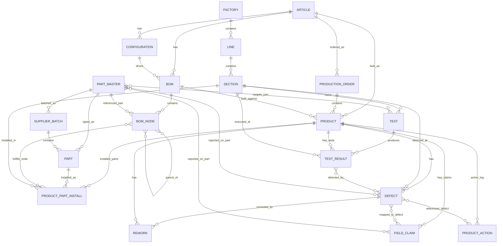

# Schema

19 tables. Strict subset of Manex production — only `PROCESS_PARAMETER`
is excluded. Every column, type, and FK relationship matches production.

## ER diagram

## ID conventions

Every ID is `TEXT` with a prefix:

| Prefix | Table                |
|--------|---------------------|
| `FAC-` | factory              |
| `LIN-` | line                 |
| `SEC-` | section              |
| `ART-` | article              |
| `CFG-` | configuration        |
| `BOM-` | bom                  |
| `BN-`  | bom_node             |
| `PM-`  | part_master          |
| `SB-`  | supplier_batch       |
| `P-`   | part (6 digits)      |
| `PO-`  | production_order     |
| `PRD-` | product              |
| `PPI-` | product_part_install (6 digits) |
| `TST-` | test                 |
| `TR-`  | test_result (6 digits) |
| `DEF-` | defect               |
| `FC-`  | field_claim          |
| `RW-`  | rework               |
| `PA-`  | product_action       |

## Core tables

### PRODUCT
Central node. Every quality event references a product.

Fields: `product_id`, `article_id`, `configuration_id`, `bom_id`, `order_id`, `build_ts`.

### DEFECT
In-factory quality event. Links product → section(s) → part → test_result.

Fields: `defect_id`, `product_id`, `ts`, `source_type`, `defect_code`,
`severity` (low/medium/high/critical), `detected_section_id`,
`occurrence_section_id`, `detected_test_result_id`, `reported_part_number`,
`image_url`, `cost`, `notes`.

### FIELD_CLAIM
External quality event. Customer reported failure post-ship.

Fields: `field_claim_id`, `product_id`, `claim_ts`, `market`,
`complaint_text` (German), `reported_part_number`, `image_url`, `cost`,
`detected_section_id`, `mapped_defect_id`, `notes`.

### TEST_RESULT
A single measurement. `overall_result` is `PASS` / `MARGINAL` / `FAIL`.

Fields: `test_result_id`, `test_run_id`, `test_id`, `product_id`,
`section_id`, `ts`, `test_time_ms`, `overall_result`, `test_key`,
`test_value`, `unit`, `notes`.

### TEST
Test definition (title, limits, units).

Fields: `test_id`, `section_id`, `part_number` (optional, when part-specific),
`title`, `test_location`, `test_type`, `lower_limit`, `upper_limit`,
`image_url`, `notes`.

### REWORK
Corrective action for a defect.

Fields: `rework_id`, `defect_id`, `product_id`, `ts`, `rework_section_id`,
`action_text` (German), `reported_part_number`, `user_id`, `image_url`,
`time_minutes`, `cost`.

### PRODUCT_ACTION
Closed-loop workflow — initiatives, investigations, 8D tracking.
**Teams can freely INSERT / UPDATE rows here.**

Fields: `action_id`, `product_id`, `ts`, `action_type`, `status`,
`user_id`, `section_id`, `comments`, `defect_id`.

### BOM_NODE
Two-level hierarchy: `assembly` → `component`.
`parent_bom_node_id` is NULL for assemblies.

Fields: `bom_node_id`, `bom_id`, `parent_bom_node_id`, `part_number`,
`qty`, `node_type`, `find_number` (e.g. "C12", "R33").

### PRODUCT_PART_INSTALL
Instance-level: which physical `part_id` went into which `product_id`,
fulfilling which `bom_node_id`.

Fields: `install_id`, `product_id`, `part_id`, `bom_node_id`,
`installed_section_id`, `qty`, `position_code`, `installed_ts`, `user_id`.

## Dimension tables

`factory`, `line`, `section`, `article`, `configuration`, `bom`,
`part_master`, `supplier_batch`, `part`, `production_order`.

See the migration file
[supabase/migrations/00001_create_schema.sql](../supabase/migrations/00001_create_schema.sql)
for exact column definitions.

## Views

- `v_defect_detail` — defect + product + article + detected/occurrence sections + reported part + test.
- `v_product_bom_parts` — installed parts per product with batch + supplier.
- `v_field_claim_detail` — claim + product + mapped defect + part + section + `days_from_build`.
- `v_quality_summary` — weekly rollup per article.

## DB roles

- `seed_readonly` — SELECT on all seed tables.
- `team_writer` — inherits `seed_readonly`, plus INSERT/UPDATE/DELETE on
  `product_action` + `rework`, plus `CREATE` on `public` schema.
- Your team's psql user (`team_writer_<slug>`) has `team_writer`.
- REST anon key also has `team_writer` privileges.

Seed tables are effectively read-only from both access paths.
